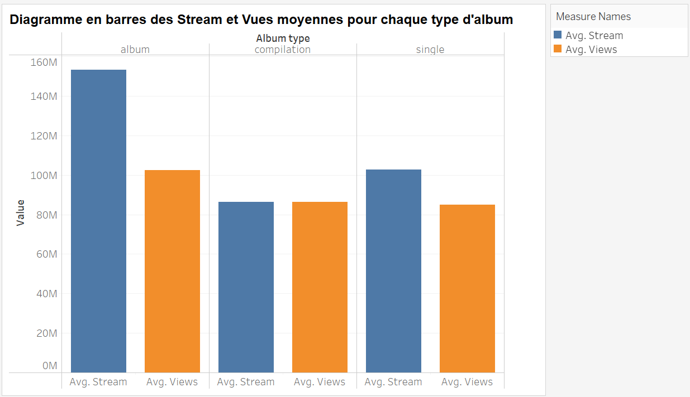

# Projet : Analyse exploratoire d'un jeu de données d'un ensemble de titres présents sur les plateformes Youtube et Spotify

> Equipe Zelda :\
> Zoé Boutin, Brian Diffo Diffo, Hanxiao Sun, He Huang

## Introduction

Dans le cadre de l'unité d'enseignement IF36 de l'Université de
Technologie de Troyes, nous entreprenons ce projet d'analyse
exploratoire d'un dataset choisi pour mettre en pratique nos
connaissances en data visualisation.

### Jeu de Données

Les données utilisées dans ce projet de data visualisation sont des
informations sur des chansons publiées sur Spotify et Youtube. Nous
avons accès à des informations générales sur chaque titre comme
l'artiste et l'album ou le single dont il est issu, ainsi que des
attributs comme le tempo, la duration ou encore la danceabilité. Notre
jeu de données peut être répartit en trois sous-groupes : les
informations générales sur le titre, les informations liées à Spotify
(nombre de streams, URI,...) et les informations liées à Youtube (nombre
de vues, nombres de likes, chaîne youtube,...).

Les données ont été collectées sur la plateforme Kaggle. Mais le dataset
ne contenait pas les dates de sortie des chansons, ce qui est une
information très importante. Nous avons donc utilisé l'identifiant
unique de chaque chanson (URI) pour récupérer sa date de sortie grâce à
l'API Spotify et la bibliothèque 'spotifyr' de R.

### Motivations

Nous avons choisi ce jeu de données du fait de la diversité et richesse
des données. Le dataset comprend 19064 lignes, chaque ligne représentant
une chanson d'artistes variés à travers le monde. Les 26 variables
présentes pour chaque chanson offrent une richesse d'informations,
incluant des données générales plus textuelles sur chaque titre comme le
nom de la chanson et l'artiste. Mais ce qui nous a particulièrement plu
sont les informations statistiques sur les plateformes Spotify et
Yotube, qui nous permettront de faire une comparaison entre les deux
plateformes. Enfin, le dataset comporte des données sur les attributs
musicaux de chaque chanson (danceabilité, énergie, tonalité, volume,...)
sous forme de coefficients ou autre valeurs numériques que l'ont a
trouvé très pertinent à analyser.

La musique est un élément central de la culture populaire, touchant un
large public. Analyser les données musicales permet non seulement
d'explorer des tendances et des comportements sur les plateformes
populaires comme Spotify et Youtube, mais aussi de répondre à des
questions d'intérêt général sur la musique, comme :

-   Quels sont les attributs musicaux des chansons les plus streamées ou
    les plus vues ?

-   Y a-t-il une corrélation entre les streams Spotify et les vues
    YouTube ?

-   Quels genres ou artistes sont les plus populaires ?

Nous avons tous utilisé Spotify ou Youtube pour écouter de la musique,
ce qui rend le sujet non seulement pertinent mais aussi personnellement
intéressant. En travaillant sur ce projet, nous pouvons combiner notre
passion pour la musique avec nos compétences techniques en data science,
ce qui rend l'expérience d'apprentissage à la fois enrichissante et
motivante.

## Problématique

**Comment les caractéristiques musicales et les métriques d'engagement
des chansons publiées sur Spotify et YouTube influencent-elles leur
popularité et leur consommation sur ces plateformes de streaming, et
quelles tendances peuvent être dégagées de ces données en termes de
temporalité, d'attributs musicaux et de comportement des utilisateurs
?**

Nous avons centré notre analyse autour de certains axes d'analyse pour
répondre à cette problématique :

-   **Influence des caractéristiques musicales** : Analyse des attributs
    des chansons (danceabilité, énergie, etc.) sur leur popularité.

-   **Temporalité** : Impact de la date de sortie des chansons sur leur
    nombre de streams et de vues.

-   **Comparaison des plateformes** : Relation entre les métriques
    d'engagement sur Spotify et YouTube.

-   **Consommation des singles vs. albums** : Préférences des
    utilisateurs pour différents types de publications.

-   **Effet des caractéristique supplémentaires (featuring, musique
    officielle et/ou sous license)** : Impact des collaborations, de
    l'officialité et des licenses sur la popularité des titres.

-   **Evolution des tendances** : Changements dans les attributs des
    chansons au fil du temps.

## Collecte et Préparation des Données

### Importation des modules

Nous utilisons des librairies non inhérentes au R basique dans notre
analyse explorative. Les librairies/packages que nous chargeons font
partie du Tidyverse.

```{r}
# Uncomment the lines if you need to install a package before loading it:
# install.packages("readr")
# install.packages("dplyr")
# install.packages("tidyr")
# install.packages("stringr")
# install.packages("tibble")
# install.packages("ggplot2")
# install.packages("patchwork")
# install.packages("ggforce")
# install.packages("tidyverse")
# install.packages("cluster")
# install.packages("factoextra")
# install.packages("factomineR")
# install.packages("glue")
# install.packages("ggtext")
# install.packages("gridExtra")
# install.packages("stringr")
# install.packages("ggstatsplot")
# install.packages("plotly")

library(readr)
library(dplyr)
library(tidyr)
library(stringr)
library(tibble)
library(ggplot2)
library(patchwork)
library(ggforce)
library(tidyverse)
library(cluster)
library(factoextra)
library(FactoMineR)
library(glue)
library(ggtext)
library(gridExtra)
library(stringr)
library(ggstatsplot)
library(plotly)
library(lubridate) 

```

### Chargement des données depuis le fichier CSV

Notre jeu de données est stocké dans un fichier CSV (Excel). Nous devons
importer les données dans notre code pour les transformées en
'dataframe' (type de variable en R) afin de pouvoir utiliser des
fonctions de R et de nos librairies du Tidyverse pour 'Explorer' nos
données.

```{r}
# Nous travaillons avec le fichier ayant le chemin suivant : "/data/dataset_if36"
dataset_if36 <- read.csv('data/dataset_if36.csv')
```

### Séparation de la date en année en mois et en jour

La date étant sous format chaine de caractère , cette transformation
permettra de faciliter les analyses liées à l'évolution du temps.

```{r}
#en R , les doubles crochet[[]] permettent d'accéder aux élements d'une liste et non d'un vecteur[]
#sapply est une fonction en R permettant d'appliquer une fonction à chaque élément d'un vecteur
df <- dataset_if36 %>%
  mutate(date_split = strsplit(date, split = "-"),
         annee = as.double(sapply(date_split, "[", 1)),
         mois = as.double(sapply(date_split, "[", 2))) %>%
  select(-date_split) %>%
  filter(!is.na(annee) & !is.na(Stream) & !is.na(Views)) %>%
  filter(is.finite(Stream) & is.finite(Views)) %>%
  filter(annee!=0)


df_sorted <- df %>%
  filter(annee!=0)%>%
  arrange(annee, mois)

```

Maintenant que nos données sont chargées, elles sont prêtes pour
l'analyse.

## Exploration

Afin de facilité la compréhension et la répartition des tâches, nous
avons organisé notre analyse par question.

### Question 1:

[***La date de sortie d'un titre a-t-elle un effet sur son nombre
d'écoutes ?***]{.underline}

[*Sous-question :*]{.underline} ***Est-ce que l'échantillon de titres du
dataset est composé majoritairement de titres qui sont 'populaires'
indépendamment du temps ?***

-   On s'attend à ce que : plus un titre a été publié il y a longtemps,
    plus il a de views/streams.

-   Ou à l'inverse, la date de publication n'a pas une grande
    corrélation avec le nombre d'écoutes et donc on peut dire que ce
    nombre d'écoute est purement lié à la popularité du titre.

##### Selection des colonnes qui nous intéressent pour cette question et transfer dans un nouveau dataframe 'df_q1'

```{r}
df_q1 <- df %>%
  select(date, annee, mois, Stream, Views, Likes)

#Transformation du type de la colonne 'date' de chr à date
df_q1$date <- as.Date(df_q1$date)

head(df_q1)
```

##### Création d'une colonne représentant le nombre total d'écoutes d'un titre indépendamment de la plateforme

```{r}
df_q1 <- df_q1 %>%
  mutate(ecoutes_totales = Stream + Views)

# Supprimer les lignes avec des valeurs manquantes dans la colonne 'date'
df_q1 <- df_q1[!is.na(df_q1$date), ]


head(df_q1)
```

Nous avons donc préparer un dataframe plus restreint pour cette
question.

Avant de continuer avec l'analyse de cette question, il est important de
comprendre quels choix d'échantillonage ont été faits lors de la
création de ce jeu de données. Ce dataset ne comprend pas tous les
titres spotify et youtube disponibles (il serait beaucoup trop grand
pour notre cas d'utilisation dans ce scénario là), l'échantillon que
nous avons a un grand effet sur les résultats et conclusions qu'on
pourra en déduire. C'est donc important de comprendre les limitations de
notre jeu de données pour les prendre en compte dans nos déductions et
conclusions à venir.

##### Analyse de la distribution des chansons du jeu de données en fonction de l'année

```{r}
df_q1 %>%
    ggplot(aes(x = annee)) +
    geom_histogram(binwidth = 1,  alpha = 0.7,
                   color = "lightblue", fill = "lightblue") +
    scale_y_continuous(expand = expansion(mult = c(0, 0))) +
    scale_x_continuous(breaks = seq(min(df_q1$annee), max(df_q1$annee), by = 2)) +
    labs(x = "Année",
         y = "Count",
         title = "Distribution des titres du jeu de données en fonction de l'année de publication") +
    theme_minimal() +
    theme(axis.text.x = element_text(angle = 90, hjust = 1, size = 6),
          axis.ticks.x = element_line())
```

On remarque que les chansons de notre dataset sont seulement des titres
publiés entre 1918 et 2023. De plus, le jeu de données a beaucoup plus
de chansons publiées depuis 2000 qu'avant avec une grande majorité pour
les titres publiés en 2022. La distribution en termes d'année de
publication du jeu de données n'est donc pas du tout régulière : le
dataset est surtout concentré sur les chansons entre 2000 et 2023.

Nous avons pensé à faire un diagramme en camembert par année des
chansons pour mieux comprendre la décomposition du jeu de données par
années de publication.

##### Décomposition du jeu de données par années de publication

```{r}
# Aggregate data by year and create the new category
df_q1_agg <- df_q1 %>%
    mutate(annee_group = case_when(
        annee < 2000 ~ '1918-1999',
        annee > 1999 & annee < 2016 ~ '2000-2015',
        TRUE ~ as.character(annee)
    )) %>%
    count(annee_group)

# Create the pie chart
df_q1_agg %>% 
    ggplot(aes(x = "", y = n, fill = annee_group)) +
    geom_bar(width = 1, stat = "identity") +
    coord_polar(theta = "y") +
    scale_fill_brewer(palette = "Paired") +
    geom_mark_hull(aes(filter = annee_group == "2022",
                        label = '2022',
                        description = 'Environ 1/5 des titres sortis en 2022'),
                   fill = NA,
                   color = NA) +
    labs(x = NULL,
         y = NULL,
         fill = "Année",
         title = "Décomposition du jeu de données par année de publication") +
    theme_minimal() +
    theme(axis.text.x = element_blank(),
          axis.ticks = element_blank(),
          panel.grid = element_blank())
```

On remarque donc que les titres avant 2000 ne représentent même pas
autant de titres de 2022 qui comptent pour environ 1/5 du jeu de
données.

D'après la spécifications du jeu de données sur Kaggle : il a été créé
et collecté le 7 février 2023. Ceci explique le peu de titres de 2023
malgré la tendance a avoir plus de titres réprésentés, plus le temps
avance. L'échantillon de données est plus concentré sur des titres
sortis 'récemment' par rapport à la création du dataset.

On peut aussi faire cette analyse du choix d'échantillonage vis à vis du
nombre d'écoutes.

##### Analyse de la distribution des titres du jeu de données en fonction du nombre d'écoutes

```{r}
ecoute_plot <- df_q1 %>%
    ggplot(aes(x = ecoutes_totales)) +
    geom_histogram(bins = 60, alpha = 0.7,
                   color = "lightgreen", fill = "lightgreen") +
    scale_y_continuous(expand = expansion(mult = c(0, 0))) +
    scale_x_continuous(labels = scales::number_format()) +
    labs(x = "Année",
         y = "Count",
         title = "Distribution des titres du jeu de données en fonction du nombre d'écoutes") +
    theme_minimal()

ecoute_zoomed_plot <- df_q1 %>%
    ggplot(aes(x = ecoutes_totales)) +
    geom_histogram(binwidth = 25000000, alpha = 0.7,
                   color = "lightgreen", fill = "lightgreen") +
    scale_y_continuous(expand = expansion(mult = c(0, 0))) +
    scale_x_continuous(labels = scales::number_format(), breaks = seq(0, 250000000, by = 25000000)) +
    coord_cartesian(xlim = c(0, 500000000), ylim = c(0, 3000)) +
    labs(x = "Année",
         y = "Count",
         title = "Zoom sur le pic vers 0") +
    theme_minimal() +
    theme(axis.text.x = element_text(angle = 45, hjust = 1, size = 6))

ecoute_plot /
ecoute_zoomed_plot
```

On remarque que le jeu de données a des titres avec des nombres
d'écoutes allant de moins de 50 millions jusqu'à presque 10 milliards.
La plupart des titres ont moins de 500 millions d'écoutes totales.

```{r}
min_ecoutes_totales <- min(df_q1$ecoutes_totales, na.rm = TRUE)
print(min_ecoutes_totales)
```

Le minimum d'écoutes totales est 7020.

Il semble donc que le jeu de données ne soit pas limité à des titres
très populaires. Cependant, il est concentré sur des titres relativement
beaucoup écoutés : la majorité des titres ayant entre 25 et 50 millions
d'écoutes ce qui est quand même conséquent.

On peut maintenant passer à l'analyse plus pertinente à la question
posée.\
(Rappel de la question : La date de sortie d'un titre a-t-elle un effet
sur son nombre d'écoutes ?)

##### Nombre total d'écoutes en fonction de l'année de publication

```{r}
# Use factor() to convert a numeric variable into a discrete variable
df_q1 %>%
  ggplot(aes(x = factor(annee), y = ecoutes_totales)) +
  geom_point(alpha = 0.1, color = "darkcyan") +
  scale_y_continuous(labels = scales::number_format()) +
  stat_summary(aes(group = 1, color = "Mean"), fun = mean, geom = 'line', size = 1, alpha = 0.7) +
  stat_summary(aes(group = 1, color = "Median"), fun = median, geom = 'line', size = 1, alpha = 0.7) +
  scale_color_manual(values = c("Mean" = "orange", "Median" = "yellow")) +
  labs(x = "Année", y = "Nombre total d'écoutes", 
       title = "Ecoutes totales par année de publication", 
       color = "Mesures") +
  coord_trans(y = 'log') +
  theme_minimal() +
  theme(axis.text.x = element_text(angle = 90, hjust = 1, size = 6),
        legend.position = "right")

```

Nous avons utilisé un diagramme de points pour d'abord voir 'toutes' les
données sans appliquer de statistique descriptive comme les boîtes à
moustaches. C'est pertinent dans le sens où l'on peut voir la densité
des points et on a pû ajouter les courbes de moyenne et médiane pour
avoir une légère couche statistique pour aider l'analyse.

On remarque que la moyenne et la médiane sont plutôt constantes en
fonction du temps. Il y a une concentration plus élevée de points
(titres) plus l'année est grande, ce qui est raccord à notre analyse de
la distribution des chansons du jeu de données en fonction de l’année.

En rappelant que l'échelle du nombre d'écoutes est logarithmique, on
remarque qu'il y a plus de titres avec un nombre d'écoutes énorme (les
valeurs vers 10 milliards d'écoutes qu'on a vues dans la distribution en
fonction du nombre d’écoutes) à partir de 2006 environ.

Or c'est aux alentours de 2006-2008 que sont apparues les plateformes de
streaming qu'on étudie : Spotify et Youtube. Notre observation
d'outliers en termes d'un grand nombre d'écoutes est donc probablement
liée à l'émergeance de ces plateformes.

##### Diagramme en boîte à moustache du nombre d'écoutes total en fonction de l'année de publication (regroupée par décennie)

```{r}
# Créer une nouvelle variable 'decennie' représentant la décennie
df_q1$decennie <- as.factor((as.integer(df_q1$annee) %/% 10) * 10)

# Use factor() to convert a numeric variable into a discrete variable
# Créer le diagramme en boîte avec ggplot2
df_q1 %>%
  ggplot(aes(x = factor(decennie), y = ecoutes_totales)) +
  geom_boxplot(color = "darkcyan", fill = "lightblue") +
  scale_y_continuous(labels = scales::number_format()) +
  labs(x = "Décennie", y = "Nombre d'écoutes total", title = "Ecoutes totales par décennie en échelle logarithmique") +
  coord_trans(y = 'log10') +
  theme_minimal()
```

Nous avons utilisé un diagramme en boîte à moustache (box and whisker
plot) car nous avons discrétisé le temps par année et que nous voulions
nous concentrer sur la distribution statistique des valeurs afin d’en
extraire des tendances (si il en existe). Ce graph est pertinent car il
synthétise bien nos valeurs discrètes et facilite la recherche d’une
relation entre la date de publication d’un titre et son nombre d’écoutes
total. On peut faire notre analyse en omettant la décennie 1910 étant
donné qu'il n'y a qu'un seul titre dans cette période : l'application
statistique de la boîte à moustache n'a aucun intérêt dans ce cas
précis.

En regroupant par décennie, on retrouve cette présence accrue d'outliers
plus écoutés sur les deux dernières décennies. Notre interprétation est
qu'avec la démocratisation grandissante des moyens de partager
l'information (la musique en faisant partie) vers un grand public, il
devient de plus en plus facile pour des chansons de devenir très
populaires et ce très vite. La notion de "tubes du moment" ou de
"chansons qui font le buzz" que nous connaissons tous aujourd'hui créée
des titres qui représentes ces valeurs 'outliers' avec des nombres
d'écoutes pharamineux dans notre graphique. L'émergeance des plateformes
de streaming comme celles qu'on étudie, Spotify et Youtube, permet aussi
de rendre plus accessible ces "tubes" ce qui peut à la manière d'une
réaction en chaîne, accéléré le phénomène de "buzz" d'un "tube".

On remarque aussi que les boites qui représentent les valeurs entre le
premier quartile et le troisième quartile ont à peu près toutes la même
taille et le même nombre d'écoutes médian. Ainsi, même si notre jeu de
données a beaucoup plus de titres 'récents' : les écoutes totales sont
plutôt équilibrées en moyenne. Ceci confirme notre observation que ce
jeu de données est plutôt concentré sur des chansons qui sont
relativement populaires et ce indépendamment du temps étant donné que
nous avons des boîtes à moustaches similaires pour chaque décennie.

Cela confirme donc notre hypothèse initiale que les chansons plus
anciennes (surtout celles datant d'avant Spotify et Youtube)
représentées dans ce dataset sont des chansons encore toujours
relativement "populaires" aujourd'hui : des chansons "intemporelles"
comme des titres des Beatles ou de Queen par exemple.

Nous avons fait notre analyse sur le nombre d'écoutes total : retrouve
t'on les mêmes conclusions en prenant indépendemment les Streams Spotify
et les Vues Youtube ?

##### Nombre de Streams / Vues en fonction de l'année de publication

```{r}
# Find the range of the y-axis to use for both plots
y_limits_stream <- range(df_q1$Stream, na.rm = TRUE)
y_limits_view <- range(df_q1$Views, na.rm = TRUE)
shared_y_limits <- range(y_limits_stream, y_limits_view)

# Create the stream plot
stream_plot <- df_q1 %>%
  ggplot(aes(x = factor(annee), y = Stream)) +
  geom_point(alpha = 0.1, colour = "darkcyan") +
  scale_y_continuous(labels = scales::number_format(), limits = shared_y_limits) +
  stat_summary(aes(group = 1), fun = mean, geom = 'line', size = 1, colour = "orange", alpha = 0.7) +
  stat_summary(aes(group = 1), fun = median, geom = 'line', size = 1, colour = "yellow", alpha = 0.7) +
  labs(x = "Année", y = "Nombre de Streams / Vues",
       title = "Streams par année de publication") +
  coord_trans(y = 'log') +
  theme_minimal() +
  theme(axis.text.x = element_text(angle = 90, hjust = 1, size = 6))

# Create the view plot
view_plot <- df_q1 %>%
  ggplot(aes(x = factor(annee), y = Views)) +
  geom_point(alpha = 0.1, colour = "darkcyan") +
  scale_y_continuous(labels = NULL, limits = shared_y_limits) +
  stat_summary(aes(group = 1, color = "Moyenne"), fun = mean, geom = 'line', size = 1, alpha = 0.7) +
  stat_summary(aes(group = 1, color = "Médiane"), fun = median, geom = 'line', size = 1, alpha = 0.7) +
  scale_color_manual(values = c("Moyenne" = "orange", "Médiane" = "yellow")) +
  labs(x = "Année", y = NULL,
       title = "Vues par année de publication",
       color = "Mesures") +
  coord_trans(y = 'log') +
  theme_minimal() +
  theme(axis.text.x = element_text(angle = 90, hjust = 1, size = 6),
        legend.position = "bottom")

# Use the patchwork package to display the plots together
stream_plot + view_plot + plot_annotation(title = 'Graphiques en échelle logarithmique')
```

On peut dire que de manière générale, on retrouve la même forme de
graphique quand on prend nos variables indépendantes.

On remarque tout de même que les Streams Spotify sont plus constants au
niveau du temps que les Vues Youtube. La moyenne et la médiane des
Streams est plutôt constante alors qu'on remarque de plus grandes
fluctuations pour les Vues. Le nombre de Vues semble être croissant en
fonction de l'année de publication.

Notre interprétation est que les auditeurs/utilisateurs utilisent plus
Youtube pour les chansons récentes car il apprécient la valeur ajoutée
de la vidéo (la production de "clips" pour les chansons c'est
démocratisée depuis l'arrivée de la télévision dans les foyers). Or plus
une chansons est ancienne, moins il y a de chance qu'elle est un "clip"
associé.

Ainsi, les auditeurs utilisent plus Spotify pour écouter les titres
qu'ils apprécient indépendamment de leur ancienneté alors qu'ils
utilisent Youtube plus Youtube pour regarder des clips de chansons et
moins pour de l'écoute "passive" comme pour Spotify. On pourrait faire
l'hypothèse (sans pouvoir la confirmer avec les données qui sont
disponibles dans notre jeu de données) que les Streams de Spotify
proviennent souvent des mêmes utilisateurs qui écoutent plusieurs fois
le même titre parce-qu'ils l'apprécient alors que les Vues Youtube
proviennent de plus d'utilisateurs qui découvrent la musique avec son
clip (à titre personnel, il est plus probable que je partage un lien
Youtube que Spotify pour faire connaitre une chanson que j'aime bien à
un.e proche).

#### Conclusions

-   Notre dataset est échantilloné sur des titres "populaires"
    indépendemment de leur date de publication.

-   Avec l'émergeance de Spotify et Youtube, certaines chansons peuvent
    plus facilement "faire le buzz".

-   Les deux plateformes ne sont pas forcément utilisées pour les mêmes
    raisons : Spotify plus pour de l'écoute "passive" des titres déjà
    appréciés alors que Youtube pour pour de la découverte de chansons ?

### Question 2:

Existe t'il une relation entre le nombre de streamings Spotify ainsi que
le nombre de vues sur Youtube ?

-   On s'attend à ce que les chansons plus 'vieilles' aient plus de vues
    totales sur Youtube car Youtube existe depuis plus longtemps.

-   Cependant on s'attend à ce que les chansons plus 'récentes'
    (publiées après Spotify) aient plus de streams totaux sur Spotify
    car il semblerait que Spotify tend à remplacer Yotube pour l'écoute
    de musique depuis sa création (hypothèse qu'on pourra essayer de
    vérifier par l'analyse aussi)

##### Récupation des données du nombre de stream avant et après 2008

```{r}
#total des vues et stream de musiques par années
stream_views_annee <- df_sorted %>%
  group_by(annee)%>%
  summarise(stream=sum(Stream), view=sum(Views))


#chanson  avant 2008
stream_view_2008 <- df_sorted %>%
  select(Views, Stream, annee, mois)%>%
  filter(annee<2008)

#chanson après 2008
stream_view_2009 <- df_sorted %>%
  select(Views, Stream, annee, mois)%>%
  filter(annee>2008)
```

##### Nuage de point sensé représenter la relation entre le nombre de vues et le nombre de stream

```{r}

#représentation des nuages de point avant et après 2008
ggplot_1 <- ggplotly(ggplot(stream_view_2008, aes(x = Stream, y = Views)) +
                             geom_point(color = "blue")+geom_smooth()+scale_x_log10()+scale_y_log10()+
                             labs(title="relation between Stream end Views before 2008")+
                             theme(plot.title = element_text(size = 8.5)))

ggplot_2 <- ggplotly(ggplot(stream_view_2009, aes(x = Stream, y = Views)) +
                             geom_point(color = "blue")+geom_smooth()+scale_x_log10()+scale_y_log10()+
                             labs(title="relation between views and stream from 2008")+
                             theme(plot.title = element_text(size = 8.5)))
ggplot_1
ggplot_2


```

```{r}
#comparaison annuelle entre le nombre de vues et le nombre de stream

ggplot(stream_views_annee)+geom_line(aes(x=annee, y=stream), color="blue")+
  geom_line(aes(x=annee, y=view), color="red")+
  scale_color_manual(values = c("Stream" = "blue", "View" = "red"))+
  scale_x_continuous(breaks = seq(1913, 2023, by = 10))

```

#### Analyse

les deux nuages de point représentent la relation entre le nombre de
stream sur Spotify et le nombre de vues sur youtube pour les chansons
sorties avant et après 2008. Comme on peut le voir , que se soit avant
ou après l'année 2008 qui est l'année à laquelle spotify a été créé , il
existe bien une relation qui tend vers la linéarité entre le nombre de
stream sur spotify et le nombre de vues sur youtube.

On peut également observer un changement entre les deux nuages de
points. en effet à près 2008, la relation est un peu moins linéaire et
on a un peu plus de point en dessous de la droite ce qui rejoint notre
hypothèse selon laquelle les chancons les plus récentes sont plus
streamées sur spotify que visionnées sur Youtube.

Enfin grace au lineplot qui permet de visualiser l'évolution annuelle du
nombre de vues sur youtube et du nombre de stream sur spotify on peut
voir que pour les chanson sorties à partir de 2010, on a une
augmentation du nombre d'écoute sur spotify par rapport à youtube.

### Question 3

[***Est-ce que les singles sont plus écoutés/appréciés des auditeurs que
les albums ?***]{.underline}

*Rappel :* Les valeurs possibles pour la variable 'Album_type' sont
album, single et compilation.

-   On s'attend à ce que les singles soit plus écoutés que les albums de
    manière générale.

-   On ne sait pas trop à quoi s'attendre pour les compilations

##### Selection des colonnes qui nous intéressent pour cette question et transfer dans un nouveau dataframe 'df_q3'

```{r}
df_q3 <- df %>%
  select(Artist, Album_type, Duration_ms, Views, Stream, date, annee, mois) %>%
  na.omit()

head(df_q3)

```

Maintenant que nous avons un dataframe 'df_q3' plus adapté pour cette
question, nous allons tout d'abord analyser la proportion de chaque type
d'album dans ce jeu de données.

##### Analyse de la décomposition du jeu de données par type d'album

```{r}
df_q3 %>% ggplot(aes(x = "", fill = Album_type)) +
  geom_bar(position = "stack", width = 0.5) +
  coord_flip() +
  labs(title = "Graphique à barres empilées des Types d'album", x = "", y = "Count") +
  theme_minimal() +
  scale_fill_manual(values = c("album" = "darkcyan", "compilation" = "lightgreen", "single" = "purple"))
```

On remarque qu'une grande majorité des titres du dataset sont issus d'un
album. Environ 1/4 des titres sont issus d'un single et il y peu de
titres issus de compilations.

##### Diagramme en Boîte à moustaches de Stream et Views par Type d'Album

```{r}
# Transformer les données en format long
df_long <- df_q3 %>%
  pivot_longer(cols = c(Stream, Views), names_to = "Metric", values_to = "Value")

# Créer le boxplot avec facet_wrap
df_long %>% ggplot(aes(x = Metric, y = Value, color = Album_type)) +
  geom_boxplot(outliers = FALSE) +
  scale_y_continuous(labels = scales::number_format()) +
  facet_wrap(~ Album_type) +
  labs(title = "Diagramme en Boîte à moustaches de Stream et Views par \nType d'Album", x = "", y = "Nombre de Streams / Vues") +
  theme_minimal()
```

##### Visualisation faite avec Tableau :



On s'attendais à ce que les singles soient plus écoutés que les albums
puisqu'ils sont souvent plus mis en avant de manière individuelle par
rapport aux albums. Mais on observe que les albums sont plus écoutés que
les singles. Ceci est surtout vrai sur Spotify : il n'y a pas de grande
différences pour Youtube.

Il n'y a pas de grande différence entre les singles et les compilations,
la moyenne des Streams pour les singles est légèrement plus élevée mais
les médianes sont très proches. On peut à la limite dire qu'il y a plus
de d'outliers avec un grand nombre d'écoute pour les singles que pour
les compilations.

#### Conclusions

-   Les chansons issues d'album sont bien plus écoutés que les singles,
    surtout sur la plateforme Spotify.

-   Les valeurs restent tout de même assez serrées, cette analyse n'est
    pas très conclusive : il faudrait peut-être plus de données pour
    faire une analyse par artiste entre les singles, albums et
    compilations. (Il n'y a pas assez de titres par artiste dans notre
    dataset pour avoir des résultats exploitables)

### Question 5:
[***Quel est le lien entre le nombre de commentaires et/ou le nombre de likes et le nombre d'écoutes d'un titre ?***]{.underline}

Variables : 'Streams', 'Views', 'Likes', 'Comments

Objectif : Relation avec valeurs discrètes.

Rappel : 
On suppose qu'on pourra repérer un seuil de nombres d'écoutes à partir duquel la quantité de like et/ou commentaires augmentent fortement. En bref, le signal à partir de ce seuil passerait de linéaire à exponentiel.

Cette hypothèse vient du fait que nous supposons qu'à partir de cette valeur seuil, il y a assez d'engouement pour un titre pour qu'il "fasse le buzz".

On a pensé à cette valeur seuil car les algorithmes de recommandation de Youtube cherchent à "faire buzzer" des vidéos (du peu que nous connaissons de ces algorithmes du côté utilisateur).

##### Nuage de point sensé représenter la relation entre le nombre de Streams et le nombre de Likes
```{r}
ggplot(dataset_if36, aes(x = Stream, y = Likes + 1)) +
  geom_point(alpha = 0.2, size = 0.3) +
  ggtitle("Relationship between Streams and Likes") +
  xlab("Streams") +
  ylab("Likes") +
  coord_fixed() +
  scale_x_log10(labels = scales::number_format()) + 
  scale_y_log10(labels = scales::number_format())

```

#### Analyse
Ce diagramme de dispersion représente la relation entre le nombre de streams sur Spotify et le nombre de likes reçus par la musique.

On peut constater qu'avec l'augmentation du nombre de streams, le nombre de likes augmente également, ce qui suggère que le contenu plus populaire obtient généralement plus de likes, ce qui est conforme à notre compréhension quotidienne.

Avec l'augmentation du nombre de streams, la dispersion du nombre de likes augmente également. Lorsque le nombre de streams atteint 100 000, la plupart des likes se situent entre 1 et 100 000, mais lorsque le nombre de streams atteint 1 000 000 000, le nombre de likes varie de 1 à près de 100 000 000. Cela indique une plus grande incertitude quant aux likes pour le contenu avec un grand nombre de streams.

Il existe quelques valeurs aberrantes possibles dans le graphique, en particulier dans la zone de forts streams. Les points ayant un grand nombre de streams mais un nombre de likes très faible peuvent représenter de la diffusion virale ou du marketing excessif de la musique.

##### Nuage de point sensé représenter la relation entre le nombre de Views et le nombre de Likes
```{r}
ggplot(dataset_if36, aes(x = Views, y = Likes + 1)) +
  geom_point(alpha = 0.15, size = 0.3) +  
  geom_smooth(method = "lm", se = FALSE, color = "blue", linewidth = 0.5) + 
  ggtitle("Relationship between Views and Likes") + 
  xlab("Views") +  
  ylab("Likes") +  
  coord_fixed() +  
  scale_x_log10(labels = scales::number_format()) + 
  scale_y_log10(labels = scales::number_format())

```

#### Analyse
Ce graphique de dispersion représente la relation entre le nombre de vues sur YouTube et le nombre de likes reçus par la musique.

On peut observer qu'avec l'augmentation du nombre de vues, le nombre de likes augmente également. Cette forte corrélation positive suggère que les vidéos avec un grand nombre de vues ont tendance à recevoir davantage de likes. Cela est logique, car une exposition accrue entraîne généralement plus d'interaction.

En même temps, sur une échelle logarithmique, la distribution des points se rapproche d'une ligne droite. On peut ajouter une ligne dans le graphique pour visualiser cela, ce qui indique une relation de puissance entre les vues et les likes. Sur une échelle logarithmique, chaque augmentation de pourcentage fixe dans le nombre de vues entraîne également une augmentation de pourcentage fixe dans le nombre de likes.

##### Nuage de point sensé représenter la relation entre le nombre de Views et le nombre de Comments
```{r}
ggplot(dataset_if36, aes(x = Views, y = Comments + 1, 
                         color = ifelse(Comments + 1 < 2, "blue", "black"))) +
  geom_point(alpha = 0.2, size = 0.3) +
  ggtitle("Relationship between Views and Comments") +
  xlab("Views") +
  ylab("Comments") +
  coord_fixed() +
  scale_x_log10(labels = scales::number_format()) +  # Assuming there are no zero or negative values in Views
  scale_y_log10(labels = scales::number_format()) +
  scale_color_manual(values = c("blue" = "blue", "black" = "black"))+
  theme(legend.position = "none")

```

#### Analyse
Ce graphique de dispersion représente la relation entre le nombre de vues sur YouTube et le nombre de commentaires reçus par la musique.

En observant les points noirs, on peut remarquer qu'avec l'augmentation du nombre de vues, le nombre de commentaires augmente également. Cette corrélation positive suggère que les vidéos avec un grand nombre de vues ont tendance à recevoir plus de commentaires.

Les points bleus dans le graphique représentent les cas où le nombre de commentaires est de zéro. Certains vidéos, bien qu'ayant un grand nombre de vues, n'ont toujours pas de commentaires. Cela peut être dû au fait que les créateurs ont désactivé les commentaires sur la vidéo.

Pour des vidéos avec le même nombre de vues, le nombre de commentaires peut varier. Cela peut être dû au contenu de la musique, certaines musiques étant plus susceptibles de susciter des commentaires que d'autres. De plus, pour des vidéos avec le même nombre de commentaires, le nombre de vues peut également varier. Par exemple, il existe des vidéos avec plus d'un million de vues qui ont moins de dix commentaires, tandis que d'autres vidéos avec moins de mille vues ont également moins de dix commentaires. Cela peut être dû à la nature de la musique, certaines musiques, telles que la musique de fond ou la musique dans une langue moins courante, pouvant inciter les spectateurs à apprécier la mélodie sans nécessairement laisser de commentaires.

#### Conclusions
Il existe une corrélation positive entre le nombre de streams sur Spotify et le nombre de likes, entre le nombre de vues sur YouTube et le nombre de likes, ainsi qu'entre le nombre de vues sur YouTube et le nombre de commentaires. Cependant, différent à ce que l'on pourrait penser, ces relations ne suivent pas une progression linéaire dès le départ et après une progression exponentielles. Parmi ces relations, la relation entre le nombre de vues sur YouTube et le nombre de likes suivre une loi de puissance de manière assez évidente.


### Question 7:

Est-ce qu'on peut reconnaître un artiste / un album par une combinaison
d'intervalles pour chaque attribut ?

Variables : 'Artist', 'Album', attributs

Objectif : Relation + Comparaison + Distribution avec valeurs continues
(attributs) et nominales (artistes, albums).

analyse : Quand nous parlons de « reconnaître » ou « identifier » un
artiste par les attributs, nous pensons immédiatement à la
classification hiérarchique. Il y a beaucoup de attributs qui décrire le
style de musique dans notre jeu de données choisi :
"Danceability","Energy","Key","Loudness","Speechiness","Acousticness","Instrumentalness","Liveness","Valence","Tempo".
Il est logique de faire d’abord un Analyse en composantes principales
pour rendre un représentation 2D possible.

```{r}
data <- read.csv("data/dataset_if36.csv")
selected_data <- data %>% select(Danceability, Energy, Key, Loudness, Speechiness, Acousticness, Instrumentalness, Liveness, Valence, Tempo)

scaled_data <- scale(selected_data)
pca_result <- PCA(scaled_data, scale. = TRUE)
```

Pour analyse le résultat, nous visualisons la contribution des
composantes principales :

```{r}
# L’inertie des cps
fviz_eig(pca_result)
ggsave("pca_loadings_plot.png", plot = last_plot(), width = 8, height = 6, dpi = 300)

```

Les deux première composantes représentent environ 45 % d'inertie, nous
pouvons donc dire que cette représentation n'est pas très idéal. Nous
regardons ensuite le cercle de corrélation :

```{r}
# Cercle des corrélations
fviz_pca_var(pca_result, col.var = "contrib", col.ind = "cos2", repel = TRUE)
ggsave("pca_contrib_plot.png", plot = last_plot(), width = 8, height = 6, dpi = 300)

```

```{r}
# Appliquer la classification hiérarchique sur le résultat de l'ACP
pca_scores <- as.data.frame(pca_result$x)
dist_mat <- dist(pca_scores[, 1:2], method = "euclidean")
hc <- hclust(dist_mat, method = "ward.D2")

rect.hclust(hc, k = 3)
clusters <- cutree(hc, k = 3)
clustered_data <- cbind(selected_data, Cluster = clusters)
write.csv(clustered_data, "clustered_data.csv")

clustered_data <- cbind(clustered_data, PC1 = pca_scores[, 1], PC2 = pca_scores[, 2])

#nuage des points
ggplot(clustered_data, aes(x = PC1, y = PC2, color = factor(Cluster))) +
  geom_point() +
  labs(title = "CAH sur PC1 et PC2")

```


### Question 9

**Est-ce que la fréquence de diffusion d'album / de single d'un artiste
peut avoir un effet sur sa popularité ?**

Variables : 'Streams', 'Views', 'Artist', 'Album-type', 'date' pour
obtenir la fréquence

Objectif : Relation avec valeurs discrètes (nombres d'écoutes),
nominales (artistes, type d'albums) et continues (fréquence).

Rappel :
On peut commencer par faire l'analyse indépendemment du type de l'album,
mais on a trouvé cela pertinent d'aussi voir si cette variable a un
effet sur nos résultats.

-   On suppose que d'avoir une fréquence plus élevée de publication de
    titres est liée à la popularité d'un artiste. Ceci repose sur
    l'hypothèse que le simple fait de publier donne de l'engouement
    naturel à un artiste : surtout qu'ils communiquent autour de leurs
    publication généralement.

-   Le format des single cherche plus à apporter de l'engouement pour un artiste en règle     générale : peut-être que si un artiste publie souvent des singles, il aura plus           d'écoutes ?

##### Traiter le format des dates dans les données et afficher toutes les valeurs de l'année dans la base de données
```{r}
dataset_if36 <- dataset_if36 %>%
  filter(!is.na(date)) %>%
  mutate(date = ymd(date))
dataset_if36$year <- year(dataset_if36$date)
print(dataset_if36$year)
```

Comme la période annuelle des données est trop grande, la période peut atteindre 50 ans. Au cours des 50 années, certains artistes peuvent avoir été inactifs pendant une longue période. Nous avons donc décidé d'étudier les données de 2019 à 2023 pour les analyser. 

##### Filtrez l'ensemble de données pour conserver les données de la période 2019 à 2023
```{r}
filtered_dataset <- dataset_if36 %>%
  filter(year(date) >= 2019 & year(date) <= 2023)
```

##### Regroupez par artiste, année et type d'album pour calculer le nombre de sorties et le nombre total de streams par an
```{r}
artist_yearly_filtered <- filtered_dataset %>%
  mutate(year = year(date)) %>%
  group_by(Artist, year, Album_type) %>%
  summarise(Release_Frequency = n(), Total_Streams = sum(Stream, na.rm = TRUE), .groups = 'drop')
```

##### Calculez la fréquence de sortie annuelle moyenne et le nombre total de flux par artiste, en conservant Album_type
```{r}
artist_stats_filtered <- artist_yearly_filtered %>%
  group_by(Artist, Album_type) %>%
  summarise(Avg_Frequency_2019_2023 = mean(Release_Frequency), Avg_Streams_2019_2023 = mean(Total_Streams), .groups = 'drop')
```

##### Diagramme d'un nuage de points de la fréquence des sorties et du nombre de flux, coloré par Album_type
```{r}
ggplot(artist_stats_filtered, aes(x = Avg_Frequency_2019_2023, y = Avg_Streams_2019_2023, color = Album_type)) +
  geom_point(alpha = 0.5, size = 0.8) +
  labs(title = "La relation entre Average Yearly Release Frequency et Average Yearly Streams (2019-2023)",
       x = "Average Yearly Release Frequency (2019-2023)",
       y = "Average Yearly Streams (2019-2023)") +
  theme_minimal() +
  theme(axis.text.x = element_text(hjust = 1)) +
  scale_y_continuous(labels = scales::number_format()) +
  scale_color_manual(values = c("album" = "red", "single" = "blue"))
```

##### Analyse :
Ce graphique en nuage de points illustre la relation entre le nombre moyen d'albums publiés par an et le nombre moyen de flux de sportify par an pour chaque artiste de 2019 à 2023.

On constate que pendant cette période, la plupart des artistes ont publié en moyenne entre 0 et 3 albums par an, correspondant à des flux annuels compris entre 0 et 2 500 000 000.

Le nombre d'artistes publiant en moyenne plus de 5 albums par an est faible, et pour ceux qui publient en moyenne 10 albums par an, leur flux n'est pas significativement plus élevé que ceux qui publient moins d'albums.

En revanche, plusieurs artistes qui publient en moyenne environ 4 albums par an ont généré un flux particulièrement élevé.

Cela est conforme à la logique, car publier trop d'albums en une année peut entraîner une baisse de qualité des œuvres, ce qui peut à son tour entraîner une baisse du nombre d'écoutes. En même temps, pour les artistes très connus, même s'ils publient très peu d'albums par an, ils peuvent avoir l'occasion de générer un flux très élevé.

Les points rouges sur ce graphique représentent les œuvres des artistes sous forme d'albums, tandis que les points bleus représentent les œuvres sous forme de singles.

Nous pouvons voir que dans les zones de flux élevé, presque tous les points sont rouges, tandis que les points bleus sont plus concentrés dans les zones de faible flux. De cela, nous pouvons déduire que la forme des œuvres a une certaine influence sur le nombre de flux. La forme d'un album peut, dans une certaine mesure, aider les œuvres à obtenir plus de flux.

Ensuite, nous avons commencé à faire la même analyse sur la relation entre la fréquence annuelle moyenne de sortie d’un album et les vues sur YouTube.

##### Diagramme d'un nuage de points de la fréquence des sorties et du nombre de flux, coloré par Album_type
```{r}
filtered_dataset <- dataset_if36 %>%
  filter(year(date) >= 2019 & year(date) <= 2023)

artist_yearly_filtered <- filtered_dataset %>%
  mutate(year = year(date)) %>%
  group_by(Artist, year, Album_type) %>%
  summarise(Release_Frequency = n(), Total_Views = sum(Views, na.rm = TRUE), .groups = 'drop')

artist_stats_filtered <- artist_yearly_filtered %>%
  group_by(Artist, Album_type) %>%
  summarise(Avg_Frequency_2019_2023 = mean(Release_Frequency), Avg_Views_2019_2023 = mean(Total_Views), .groups = 'drop')

ggplot(artist_stats_filtered, aes(x = Avg_Frequency_2019_2023, y = Avg_Views_2019_2023, color = Album_type)) +
  geom_point(alpha = 0.5, size = 0.8) +
  labs(title = "La relation entre Average Yearly Release Frequency et Average Yearly Views (2019-2023)",
       x = "Average Yearly Release Frequency (2019-2023)",
       y = "Average Yearly Views (2019-2023)") +
  theme_minimal() +
  theme(axis.text.x = element_text(hjust = 1)) +
  scale_y_continuous(labels = scales::number_format()) +
  scale_color_manual(values = c("album" = "red", "single" = "blue"))
```

##### Analyse :
Cette carte de dispersion montre la relation entre la fréquence moyenne annuelle de publication d'albums et les vues annuelles moyennes pour chaque artiste sur la période 2019-2023, en distinguant les types d'albums par des couleurs différentes , où le rouge représente les albums et le bleu représente les singles .

Lorsque la fréquence moyenne annuelle de publication d'albums est faible (0-2,5), la plage de variation des vues annuelles moyennes est très large, allant de presque zéro à plus de 2 milliards.

Lorsque la fréquence moyenne annuelle de publication d'albums est élevée (2,5-10), les vues annuelles moyennes tendent à être plus faibles et les points de données sont plus clairsemés, ce qui indique qu'une augmentation de la fréquence de publication d'albums n'entraîne pas nécessairement une augmentation des vues.

Globalement, il n'y a pas de corrélation positive directe entre la fréquence moyenne annuelle de publication d'albums et les vues annuelles moyennes. Les vues élevées apparaissent plus souvent dans la zone de faible fréquence de publication d'albums.

Dans la zone de faible fréquence de publication, les singles et les albums peuvent tous deux atteindre des niveaux élevés de vues. Dans la zone de haute fréquence de publication, les singles ont quelques points de vues annuelles moyennes plus élevés, tandis que les albums ont des vues annuelles moyennes relativement plus basses, ce qui pourrait indiquer que les singles sont plus susceptibles de maintenir des vues élevées lorsqu'ils sont publiés fréquemment.

Le type d'album a un certain impact sur les vues. Bien que les deux types aient des points de données avec des vues élevées dans différentes plages de fréquence de publication, les singles ont une plus grande probabilité de maintenir des vues élevées lorsqu'ils sont publiés fréquemment.

##### Conclusions :
La fréquence moyenne annuelle de publication d'albums n'a pas de relation directe avec le flux de morceaux sur Spotify et le nombre de vues sur YouTube. Il est probable que d'autres facteurs influencent davantage ces flux et ces vues. Nous supposons que ces facteurs pourraient être la popularité de l'artiste ou la qualité des chansons.

La forme de l'œuvre a un certain impact sur les flux et les vues. En ce qui concerne les flux, il semble que les gens préfèrent écouter des albums sur Spotify. Quant aux vidéos, les albums et les singles ont tous deux la possibilité d'obtenir un grand nombre de vues, mais lorsque des œuvres sont publiées fréquemment, les gens semblent préférer regarder des vidéos de singles plutôt que des albums.

### Question 10

**Quels sont les effets d'un 'feat' sur un titre ?**

Un 'featuring' en musique indique dans le titre de la chanson que
celle-ci est une collaboration entre l'auteur et l'artiste featuré.

Variables : 'Streams', 'Views', 'track', 'Artist'

Objectif : Relation avec valeurs discrètes (nombres d'écoutes) et
nominales (track, artistes).

Hypothèses :

-   On s'attend à ce qu'en général, les titres avec des 'feat' soient
    plus populaires que ceux sans, surtout au sein des chansons d'un
    même artiste.

##### Préparation d'un dataframe pour la question

```{r}
df_q10 <- df %>%
  select(Track, Artist, Views, Stream, Likes, Comments, Speechiness) %>%
  na.omit() %>%
  mutate(Feat = str_detect(Track, regex("feat", ignore_case = TRUE)))

head(df_q10)
```

##### Diagramme en Secteurs de Feat

```{r}
df_q10 %>%
  ggplot(aes(x = "", fill = Feat)) +
  geom_bar(position = "stack", width = 0.5) +
  coord_flip() +
  labs(title = "Graphique à barres empilées horizontal de Feat", x = "", y = "Count") +
  theme_minimal() +
  scale_fill_manual(values = c("TRUE" = "lightgreen", "FALSE" = "darkcyan"), 
                    labels = c("TRUE" = "Avec Feat", "FALSE" = "Sans Feat"))
```

```{r}
# Transformer les données en format long
df_long_stream_view <- df_q10 %>%
  pivot_longer(cols = c(Stream, Views), names_to = "Metric", values_to = "Value")
# Créer le boxplot avec facet_wrap
df_long_stream_view %>% ggplot(aes(x = Metric, y = Value, color = Feat)) +
  geom_boxplot(outliers = FALSE) +
  scale_y_continuous(labels = scales::number_format()) +
  facet_wrap(~ Feat) +
  labs(title = "Diagramme en Boîte à moustaches de Stream et Views par \nFeat", x = "", y = "Nombre de Streams / Vues") +
  theme_minimal()
```

```{r}
# Transformer les données en format long
df_comment <- df_q10 %>%
  pivot_longer(cols = c(Comments), names_to = "Metric", values_to = "Value")
# Créer le boxplot avec facet_wrap
feat_comment_plot <- df_comment %>% ggplot(aes(x = "", y = Value, color = Feat)) +
  geom_boxplot(outliers = FALSE) +
  scale_y_continuous(labels = scales::number_format()) +
  facet_wrap(~ Feat) +
  labs(title = "Commentaires", x = "", y = "Nombre de Commentaires") +
  theme_minimal() +
  theme(legend.position = 'none')

# Transformer les données en format long
df_like <- df_q10 %>%
  pivot_longer(cols = c(Comments), names_to = "Metric", values_to = "Value")
# Créer le boxplot avec facet_wrap
feat_like_plot <- df_like %>% ggplot(aes(x = "", y = Value, color = Feat)) +
  geom_boxplot(outliers = FALSE) +
  scale_y_continuous(labels = scales::number_format()) +
  facet_wrap(~ Feat) +
  labs(title = "Likes", x = "", y = "Nombre de Likes") +
  theme_minimal()

feat_comment_plot + feat_like_plot + plot_annotation(title = "Diagrammes en boîte à moustache de Commentaires et de Likes par Feat")
```

```{r}
df_speechiness <- df_q10 %>%
  pivot_longer(cols = c(Speechiness), names_to = "Metric", values_to = "Value")
# Créer le boxplot avec facet_wrap
df_speechiness %>% ggplot(aes(x = "", y = Value, color = Feat)) +
  geom_boxplot(outliers = FALSE) +
  #scale_y_continuous(labels = scales::number_format()) +
  facet_wrap(~ Feat) +
  labs(title = "Diagrammes en boîte à moustache de Speechiness en fonction de Feat", x = "", y = "Speechiness") +
  theme_minimal()
```

```{r}
# Create the violin plot with facet_wrap
speechiness_plt <- ggbetweenstats(
  data = df_q10,
  x = Feat,
  y = Speechiness,
  plot.type = "violin",
  pairwise.comparisons = FALSE, # Disable pairwise comparisons if not needed
  results.subtitle = FALSE, # Disable the summary statistics subtitle
  results.title = FALSE, # Disable the results title at the bottom right
  centrality.plotting = FALSE, # Disable mean value annotation
  xlab = "",
  ylab = "Speechiness",
  title = "Graphique en Violon de Speechiness par Feat",
  point.args = list(position = ggplot2::position_jitterdodge(dodge.width = 1), alpha = 0.2, size = 1, stroke = 0, na.rm = TRUE),
  ggtheme = theme_minimal()
)

# Customize the plot appearance
speechiness_plt <- speechiness_plt +
  theme(
    axis.ticks = element_blank(),
    axis.line = element_line(colour = "grey50"),
    panel.grid = element_line(color = "#b4aea9"),
    panel.grid.minor = element_blank(),
    panel.grid.major.x = element_blank(),
    panel.grid.major.y = element_line(linetype = "dashed"),
    panel.background = element_rect(fill = "#fbf9f4", color = "#fbf9f4"),
    plot.background = element_rect(fill = "#fbf9f4", color = "#fbf9f4")
  )

# Display the plot
speechiness_plt
```

#### Conclusion

## Bonus / Annexe :

Lors de nos recherches pour ce projet, nous avons trouvé les
visualisations issus du projet TidyTuesday très inspirants.

Le TidyTuesday Challenge est une initiative hebdomadaire organisée par
la communauté R for Data Science (R4DS), où les participants sont
invités à explorer, nettoyer et visualiser des jeux de données fournis
chaque mardi, en utilisant les principes de la "tidyverse" en R. Cet
exercice vise à améliorer les compétences en manipulation de données et
en visualisation tout en favorisant l'apprentissage collaboratif et le
partage de solutions créatives au sein de la communauté.

Nous avons fait une petite exploration avec le script de Jake Kaupp
(\@jkaupp sur github) pour essayer de le comprendre et approfondir notre
maitrise de R et des packages Tidyverse.

Ci-dessous se trouve notre exploration du code de Jake Kaupp pour notre
jeu de données puis sa visualisation pour une itération du TidyTuesday.

```{r}
rush <- df %>% 
  filter(!is.na(Track), Artist %in% c("Metallica", "Smash Mouth", "ABBA", "Britney Spears", "Wolfgang Amadeus Mozart"), Track %in% c("Screaming Suicide", "All Star", "Dancing Queen", "Toxic", "Piano Concerto No. 21 in C Major, K. 467: II. Andante")) %>% 
  distinct(Track, .keep_all = TRUE) %>% 
  select(Track, Artist, Danceability, Energy, Speechiness, Acousticness, Instrumentalness, Liveness, Valence, Tempo) %>% 
  mutate(color = c("#f7b801","#f18701","#f35b04","darkred","red")) %>% 
  mutate_at(vars(Track, Artist), as.character) %>% 
  mutate_at(vars(Danceability:Tempo), function(x) x/max(x)) %>% 
  pivot_longer(Danceability:Tempo) 


bg <- df %>% 
          distinct(Uri, .keep_all = TRUE) %>% 
          distinct(Track, Artist, .keep_all = TRUE) %>% 
          filter(!is.na(Track)) %>% 
          select(Track, Artist, Danceability, Energy, Speechiness, Acousticness, Instrumentalness, Liveness, Valence, Tempo) %>% 
          mutate(color = "#d8dee9") %>% 
  mutate_at(vars(Danceability:Tempo), function(x) x/max(x)) %>% 
  pivot_longer(Danceability:Tempo) 


test_plot <- ggplot(bg, aes(x = name, y = value)) +
  geom_line(aes(color = color,  group = Track), alpha = 0.1, size = 0.1) +
  geom_line(data = rush, aes(color = color, group = Artist), size = 0.5) +
  geom_point(data = rush, aes(color = color, group = Artist), size = 1) +
  geom_text(data = filter(rush, name == "Valence"), aes(label = glue("{str_replace_all(Artist, '(?<=.)(?!$)', ' ')}\n{Track}"), colour = color), family = "Arial", hjust = 0, nudge_x = 0.1, nudge_y = c(-0.05, 0, 0)) +
  scale_color_identity() +  
  scale_fill_identity() +
  scale_y_continuous(breaks = c(0, 0.5, 1), labels = c("Bas", "Moy", "Haut")) +
  scale_x_discrete(labels = function(x) str_replace_all(x, "(?<=.)(?!$)", " ")) +
  expand_limits(x = c(1, 10)) +
  labs(title = "Charactéristiques Musicales de quelques chansons",
       x = NULL,
       y = NULL) +
  theme_dark() +
  theme(axis.text.x = element_text(angle = 30, hjust = 1, size = 6),
        legend.position = "none")

test_plot
```


[Lien vers le script de \@jkaupp sur
github](https://github.com/jkaupp/tidytuesdays/blob/master/2020/week4/R/analysis.R)

### Question 11

**Y-a-t-il un lien entre les valeurs des différents attributs comme
'danceability' et 'energy' ?**

Variables : attributs quantitatifs

Objectif : Relation + Comparaison avec valeurs continues (attributs).

Hypothèses :

-   On s'attend à ce qu'il y ai des liens plus forts entre certains
    attributs qu'avec d'autres.

##### Analyse sur la question

Après tous les questions et recherches précédentes et par l'expérience
dans la vie quotidienne, on peut déjà avoir une hypothèse que certain
variable quantitatifs peuvent avoir une corrélation avec les autres. Le
but de cette question est d'essayer faire une analyse et quantifier ces
corrélation entre les attributs.
On peut facilement calculer la matrice de corrélation entre ces attributs.
```{r}
library(ggplot2)
library(reshape2)

data <- read.csv("dataset_if36.csv")
variables_quantitatives <- data[, c("Danceability", "Energy", "Loudness", "Speechiness", "Acousticness", "Instrumentalness", "Liveness", "Valence", "Tempo")]

matrice_de_corrélation <- cor(variables_quantitatives)

inertie_totale <- rowSums(abs(matrice_de_corrélation))

critère_tri <- order(inertie_totale, decreasing = TRUE)
matrice_triée <- matrice_de_corrélation[critère_tri, critère_tri]

cor_df <- as.data.frame(as.table(matrice_triée))
colnames(cor_df) <- c("variables_x", "variables_y", "valeur")

résultat <- 
    ggplot(cor_df, aes(variables_y, variables_x, fill = valeur,label = round(valeur, 2))) +
    geom_tile(color = "white") +
    geom_text(color = "black") + #afficher les valeurs de matrice 
    scale_fill_gradient2(low = "blue", high = "red", mid = "GRAY", #rendre les termes blanches visibles.
                       midpoint = 0, limit = c(-1,1), space = "Lab", 
                       name="Corrélation") +
    theme_minimal() +
    theme(axis.text.x = element_text(angle = 45, vjust = 1, 
                                   size = 10, hjust = 1)) +
    coord_fixed() +
    labs(title = "Matrice de corrélation des variables quantitatives", x = "", y = "") +
    theme(plot.title = element_text(hjust = 0.5))

print(résultat)

```
